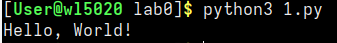

# Отчёт

## Задание
1. Создайте репозиторий для дисциплины на GitHub.
2. Склонируйте его себе на ПК.
3. Напишите свою первую программу.
4. Запустите её.
5. Сделайте коммит и пуш.
6. Напишите отчёт в README.md. Отчёт должен содержать:
    Задание
    Описание проделанной работы
    Консольные команды
    Скриншоты результатов
    Ссылки на используемые материалы
7. Добавьте для себя в отчёт шпаргалку по работе с git.

## Описание проделанной работы
1. Создал репозиторий на GitHub
2. Склонировал репозиторий на ПК
3. Написал программу
4. Запустил программу
5. Сделал коммит и отправил изменения на GitHub
6. Оформил отчёт в файле README
7. Добавил в отчёт шпаргалку по работе с git.

## Консольные команды
```bash 
git clone
python3 1.py
git add .
git commit -m 'first commit'
git push
```

## Скриншоты результатов



## Ссылки на используемые материалы
1. [Markdown guide](https://doka.guide/tools/markdown/)