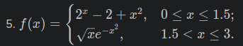
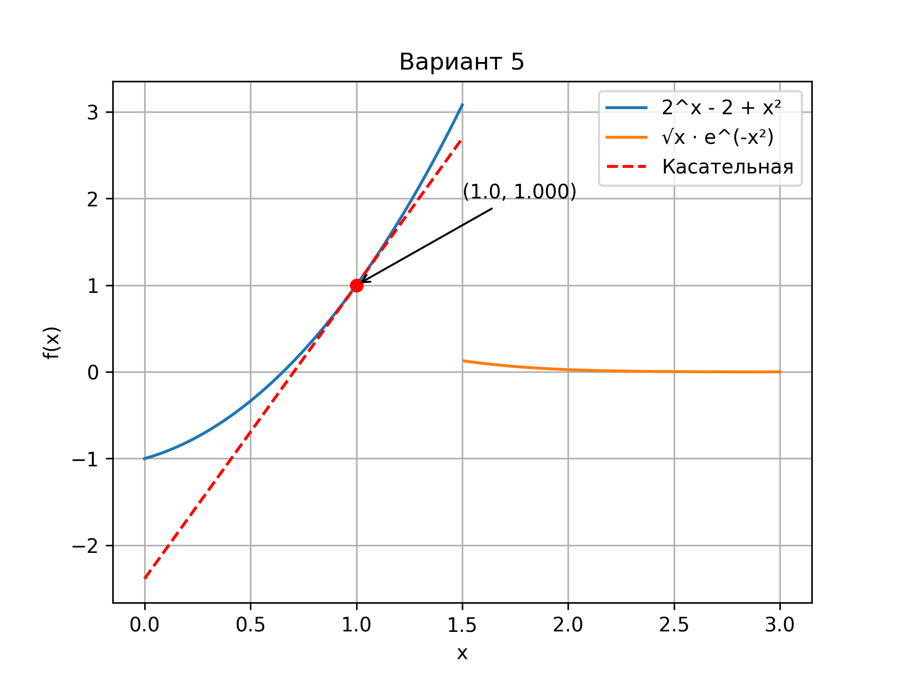

# Задание: построение графиков в Python
## Вариант 5

## 1. Описание проделанной работы:
1. Создал виртуальное окружение и установил библиотеки matplotlib и numpy
2. Изучил уроки 1-3 по построению графиков
3. Проанализировала функцию варианта 5:
4. Проверил непрерывность: в точке x=1.5 функция имеет разрыв
5. Выбрал первую часть функции для построения касательной
6. Вычислил производную: (2^x - 2 + x^2)' = 2^x · ln(2) + 2x
7. Построил график функции и касательную в точке x=1



## 2. Программа
```python
import matplotlib
matplotlib.use('Agg')
import matplotlib.pyplot as plt
import numpy as np

x1 = np.linspace(0, 1.5, 500)
x2 = np.linspace(1.51, 3, 500)

y1 = 2**x1 - 2 + x1**2
y2 = np.sqrt(x2) * np.exp(-x2**2)

x0 = 1.0
y0 = 2**x0 - 2 + x0**2
k = 2**x0 * np.log(2) + 2*x0
y_tangent = y0 + k * (x1 - x0)

plt.title('Вариант 5')
plt.xlabel('x')
plt.ylabel('f(x)')
plt.grid()
plt.plot(x1, y1, label='2^x - 2 + x²')
plt.plot(x2, y2, label='√x · e^(-x²)')
plt.plot(x1, y_tangent, 'r--', label='Касательная')
plt.plot(x0, y0, 'ro')
plt.annotate(f'({x0}, {y0:.3f})', xy=(x0, y0), xytext=(x0+0.5, y0+1),
          arrowprops=dict(arrowstyle='->'))
plt.legend()
plt.savefig('plot.png', dpi=300)
```

## 3. Вывод
-Построил кусочную функцию варианта 5. Касательная построена к первой части в точке x₀=1.
Параметры:
- Точка касания: (1; 1)
- Угловой коэффициент: k ≈ 3.386
- Уравнение касательной: y = 1 + 3.386(x - 1)

## Использованные источники:
1. [Devpractice Team. Библиотека Matplotlib.](https://evil-teacher.orbiter.website/books/prog_pm/matplotlib.pdf)