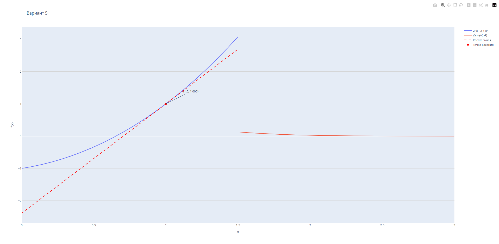

# Задание: построение графиков в Python
## Вариант 5

## 1. Описание проделанной работы:
1. Создал виртуальное окружение и установил библиотеки plotly и numpy
2. Изучил основы работы с Plotly Graph Objects
3. Проанализировал функцию варианта 5:
4. Проверил непрерывность: в точке x=1.5 функция имеет разрыв
5. Выбрал первую часть функции для построения касательной
6. Вычислил производную: (2^x - 2 + x^2)' = 2^x · ln(2) + 2x
7. Построил интерактивный график функции и касательную в точке x=1



## 2. Программа
```python
import plotly.graph_objects as go
import numpy as np

x1 = np.linspace(0, 1.5, 500)
x2 = np.linspace(1.51, 3, 500)

y1 = 2**x1 - 2 + x1**2
y2 = np.sqrt(x2) * np.exp(-x2**2)

x0 = 1.0
y0 = 2**x0 - 2 + x0**2
k = 2**x0 * np.log(2) + 2*x0
y_tangent = y0 + k * (x1 - x0)

fig = go.Figure()

fig.add_trace(go.Scatter(x=x1, y=y1, mode='lines', name='2^x - 2 + x²'))
fig.add_trace(go.Scatter(x=x2, y=y2, mode='lines', name='√x · e^(-x²)'))
fig.add_trace(go.Scatter(x=x1, y=y_tangent, mode='lines', name='Касательная', 
                        line=dict(color='red', dash='dash')))
fig.add_trace(go.Scatter(x=[x0], y=[y0], mode='markers', name='Точка касания',
                        marker=dict(color='red', size=8)))

fig.add_annotation(x=x0, y=y0, text=f'({x0}, {y0:.3f})',
                  showarrow=True, arrowhead=2, ax=100, ay=-50)

fig.update_layout(title='Вариант 5',
                 xaxis_title='x',
                 yaxis_title='f(x)',
                 showlegend=True,
                 xaxis=dict(showgrid=True, gridcolor='lightgray'),
                 yaxis=dict(showgrid=True, gridcolor='lightgray'))

fig.write_html('plot.html')
fig.show()
```

## 3. Вывод
Построил кусочную функцию варианта 5. Касательная построена к первой части в точке x₀=1.
Параметры:
- Точка касания: (1; 1)
- Угловой коэффициент: k ≈ 3.386
- Уравнение касательной: y = 1 + 3.386(x - 1)

Создан интерактивный HTML-график с помощью Plotly, доступный по ссылке:
https://konoflon.github.io/Python-labs/lab2/well-done/plot.html

## Использованные источники:
1. [Plotly](https://plotly.com/python/)