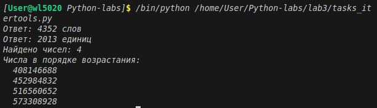

# Отчёт
## 1. Условия задач
### Задание 1
Вася составляет 6-буквенные слова, в которых могут быть использованы только буквы В, И, Ш, Н, Я, причём буква В используется не более одного раза. Каждая из других допустимых букв может встречаться в слове любое количество раз или не встречаться совсем. Слово не должно начинаться с буквы Ш и оканчиваться гласными буквами. Словом считается любая допустимая последовательность букв, не обязательно осмысленная.

Сколько существует таких слов, которые может написать Вася?
### Задание 2
Сколько единиц содержится в двоичной записи значения выражения:
4^2014+2^2015-8
### Задание 3
Найдите все натуральные числа N, принадлежащие отрезку [400 000 000; 600 000 000], которые можно представить в виде:
N=2^m*3^n, где m — чётное число, n — нечётное число.

Выведите все найденные числа в порядке возрастания.

## 2. Описание проделанной работы:
1. Импортировал модуль itertools для генерации комбинаций в первой задаче
2. Реализовал функцию task1_vasya_words():
- Сгенерировал все 6-буквенные комбинации из букв В, И, Ш, Н, Я
- Применил фильтрацию: буква В ≤ 1 раза, не начинается с Ш, не заканчивается на И/Я
- Подсчитал количество подходящих слов
3. Реализовал функцию task2_count_ones():
- Преобразовал выражение: 4^2014 = 2^4028, 8 = 2^3
- Вычислил значение и перевёл в двоичную систему
- Посчитал количество единиц методом .count('1')
4. Реализовал функцию task3_find_numbers():
- Перебрал чётные m и нечётные n в разумных пределах
- Вычислил N = 2^m · 3^n и отфильтровал по диапазону [400M; 600M]
- Отсортировал результаты по возрастанию
5. Протестировал программу и зафиксировал результаты
```python
import itertools
import itertools


def task1_vasya_words():
    letters = ['В', 'И', 'Ш', 'Н', 'Я']
    vowels = ['И', 'Я']
    count = 0
    
    for word in itertools.product(letters, repeat=6):
        if word.count('В') > 1:
            continue
        if word[0] == 'Ш':
            continue
        if word[-1] in vowels:
            continue
        count += 1
    
    return count


def task2_count_ones():
    number = 2**4028 + 2**2015 - 2**3
    binary_string = bin(number)[2:]
    ones_count = binary_string.count('1')
    return ones_count


def task3_find_numbers():
    min_value = 400000000
    max_value = 600000000
    result = []
    
    for m in range(0, 30, 2):
        for n in range(1, 20, 2):
            N = (2 ** m) * (3 ** n)
            if N >= min_value and N <= max_value:
                result.append(N)
    
    result.sort()
    return result

answer1 = task1_vasya_words()
print(f"Ответ: {answer1} слов")

answer2 = task2_count_ones()
print(f"Ответ: {answer2} единиц")

answer3 = task3_find_numbers()
print(f"Найдено чисел: {len(answer3)}")
print("Числа в порядке возрастания:")
for number in answer3:
    print(f"  {number}")
```
## 3. Скриншот

## 4. Используемы материалы
1. [Itertools в Python](https://habr.com/ru/companies/otus/articles/529356/)
2. [itertools - Functions creating iterators for efficient looping](https://docs.python.org/3/library/itertools.html)
3. [Итерируем правильно: 20 приемов использования в Python модуля itertools](https://proglib.io/p/iteriruemsya-pravilno-20-priemov-ispolzovaniya-v-python-modulya-itertools-2020-01-03)
