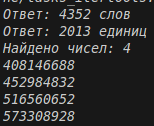

# Отчёт
## 1. Условия задач
### Задание 1
Вася составляет 6-буквенные слова, в которых могут быть использованы только буквы В, И, Ш, Н, Я, причём буква В используется не более одного раза. Каждая из других допустимых букв может встречаться в слове любое количество раз или не встречаться совсем. Слово не должно начинаться с буквы Ш и оканчиваться гласными буквами. Словом считается любая допустимая последовательность букв, не обязательно осмысленная.

Сколько существует таких слов, которые может написать Вася?
### Задание 2
Сколько единиц содержится в двоичной записи значения выражения:
4^2014+2^2015-8
### Задание 3
Найдите все натуральные числа N, принадлежащие отрезку [400 000 000; 600 000 000], которые можно представить в виде:
N=2^m*3^n, где m — чётное число, n — нечётное число.

Выведите все найденные числа в порядке возрастания.

## 2. Описание проделанной работы:
1. Импортировал модуль itertools для генерации комбинаций в первой задаче
2. Создал класс WordCounter:
- Принимает алфавит и длину слова
- Метод solve() перебирает все комбинации и применяет список условий-фильтров
- Для задачи 1: В ≤ 1 раза, не начинается с Ш, не заканчивается на И/Я
3. Создал класс BinaryCounter:
- Принимает число, метод solve() возвращает количество единиц в двоичной записи
- Для задачи 2: вычислил 4^2014 + 2^2015 - 8 как 2^4028 + 2^2015 - 2^3
4. Создал класс NumberFinder:
- Принимает формулу, диапазоны параметров и границы отрезка
- Метод solve() перебирает параметры через itertools.product, фильтрует по диапазону и сортирует
- Для задачи 3: формула 2^m * 3^n, m - чётные, n - нечётные
5. Собрал решение в main-блоке, вывел ответы в требуемом формате
```python
import itertools

class WordCounter:
    def __init__(self, alphabet, length):
        self.alphabet = alphabet
        self.length = length

    def solve(self, conditions):
        count = 0
        for word in itertools.product(self.alphabet, repeat=self.length):
            if all(cond(word) for cond in conditions):
                count += 1
        return count

class BinaryCounter:
    def __init__(self, number):
        self.number = number

    def solve(self):
        return bin(self.number)[2:].count('1')

class NumberFinder:
    def __init__(self, formula, ranges, min_val, max_val):
        self.formula = formula
        self.ranges = ranges
        self.min_val = min_val
        self.max_val = max_val

    def solve(self):
        res = []
        for params in itertools.product(*self.ranges):
            val = self.formula(*params)
            if self.min_val <= val <= self.max_val:
                res.append(val)
        res.sort()
        return res

t1 = WordCounter(['В', 'И', 'Ш', 'Н', 'Я'], 6)
vowels = {'И', 'Я'}
print(f"Ответ: {t1.solve([lambda w: w.count('В') <= 1, lambda w: w[0] != 'Ш', lambda w: w[-1] not in vowels])} слов")

t2 = BinaryCounter(4**2014 + 2**2015 - 8)
print(f"Ответ: {t2.solve()} единиц")

t3 = NumberFinder(lambda m, n: (2 ** m) * (3 ** n), [range(0, 30, 2), range(1, 20, 2)], 400000000, 600000000)
ans = t3.solve()
print(f"Найдено чисел: {len(ans)}")
for num in ans:
    print(num)
```
## 3. Скриншот

## 4. Используемы материалы
1. [Itertools в Python](https://habr.com/ru/companies/otus/articles/529356/)
2. [itertools - Functions creating iterators for efficient looping](https://docs.python.org/3/library/itertools.html)
3. [Итерируем правильно: 20 приемов использования в Python модуля itertools](https://proglib.io/p/iteriruemsya-pravilno-20-priemov-ispolzovaniya-v-python-modulya-itertools-2020-01-03)
