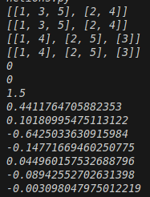

# Отчёт
## 1. Условия задач
### Задание 1
Написать функцию, которая разделяет список на n частей. Элементы распределяются по подспискам циклически по индексу.
Примеры:
- split([1,2,3,4,5], 2) → [[1, 3, 5], [2, 4]]
- split([1,2,3,4,5], 3) → [[1, 4], [2, 5], [3]]

Сколько существует таких слов, которые может написать Вася?
### Задание 2
Написать функцию для вычисления члена рекуррентной последовательности:

`v_i=(i+1)/(i^2+1)*v_{i-1}-v_{i-2}*v_{i-3}`

Начальные условия: v₁ = 0, v₂ = 0, v₃ = 1.5
Для каждой задачи реализовать два варианта решения: с использованием рекурсии и без рекурсии (итеративный).
## 2. Описание проделанной работы:
1. Реализовал функцию split_iter - итеративное разделение списка на n частей с помощью цикла и оператора %
2. Реализовал функцию split_rec - рекурсивное разделение списка с передачей индекса и аккумулятора
3. Реализовал функцию calc_v_iter - итеративный расчёт последовательности с хранением последних трёх значений
4. Реализовал функцию calc_v_rec - рекурсивный расчёт с мемоизацией через словарь cache для ускорения
5. Протестировал все функции на примерах из условия и вывел результаты
```python
def split_iter(lst, n):
    result = []
    for i in range(n):
        result.append([])
    for i in range(len(lst)):
        result[i % n].append(lst[i])
    return result

def split_rec(lst, n, i=0, result=None):
    if result is None:
        result = []
        for j in range(n):
            result.append([])
    if i >= len(lst):
        return result
    result[i % n].append(lst[i])
    return split_rec(lst, n, i + 1, result)

def calc_v_iter(i):
    if i == 1 or i == 2:
        return 0
    if i == 3:
        return 1.5
    v1 = 0
    v2 = 0
    v3 = 1.5
    for k in range(4, i + 1):
        v_new = (k + 1) / (k * k + 1) * v3 - v2 * v1
        v1 = v2
        v2 = v3
        v3 = v_new
    return v3

cache = {}

def calc_v_rec(i):
    if i in cache:
        return cache[i]
    if i == 1 or i == 2:
        return 0
    if i == 3:
        return 1.5
    result = (i + 1) / (i * i + 1) * calc_v_rec(i - 1) - calc_v_rec(i - 2) * calc_v_rec(i - 3)
    cache[i] = result
    return result

print(split_iter([1,2,3,4,5], 2))
print(split_rec([1,2,3,4,5], 2))
print(split_iter([1,2,3,4,5], 3))
print(split_rec([1,2,3,4,5], 3))

for i in range(1, 11):
    print(calc_v_iter(i))
```
## 3. Скриншот
