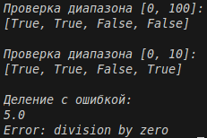

# Отчёт
## 1. Условия задач
### Задание 1
Необходимо реализовать замыкание, которое создаёт функцию для проверки принадлежности значений заданному числовому диапазону.
### Задание 2
Необходимо реализовать декоратор, перехватывающий исключения в функциях и возвращающий информативные сообщения об ошибках.
## 2. Описание проделанной работы:
### 2.1 Реализация замыкания

Создана функция `create_range_validator(min_val, max_val)`, которая:
- Принимает границы диапазона
- Возвращает внутреннюю функцию `validator(value)`
- Внутренняя функция проверяет, находится ли значение в диапазоне `[min_val, max_val]`
- Возвращает `True` если значение в диапазоне, иначе `False`

### 2.2 Реализация декоратора

Создан декоратор `safe_execute(func)`, который:
- Оборачивает функцию в try-except блок
- Перехватывает все исключения
- Возвращает сообщение об ошибке вместо аварийного завершения

### 2.3 Применение декоратора к замыканию

Создана функция `check_values(min_val, max_val, values)` с декоратором `@safe_execute`:
- Создаёт замыкание-валидатор
- Применяет его к каждому значению из списка
- Возвращает список булевых значений

```python
def create_range_validator(min_val, max_val):
    def validator(value):
        return min_val <= value <= max_val
    return validator

def safe_execute(func):
    def wrapper(*args, **kwargs):
        try:
            return func(*args, **kwargs)
        except Exception as e:
            return f"Error: {e}"
    return wrapper

@safe_execute
def check_values(min_val, max_val, values):
    validator = create_range_validator(min_val, max_val)
    return [validator(v) for v in values]

print("Проверка диапазона [0, 100]:")
print(check_values(0, 100, [50, 75, 150, -10]))

print("\nПроверка диапазона [0, 10]:")
print(check_values(0, 10, [5, 8, 12, 3]))

print("\nДеление с ошибкой:")

@safe_execute
def divide(a, b):
    return a / b

print(divide(10, 2))
print(divide(10, 0))
```
## 3. Скриншот
