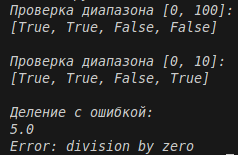

# Отчёт
## 1. Условия задач
### Задание 1
Необходимо реализовать замыкание, которое создаёт функцию для проверки принадлежности значений заданному числовому диапазону.
### Задание 2
Необходимо реализовать декоратор, перехватывающий исключения в функциях и возвращающий информативные сообщения об ошибках.
## 2. Описание проделанной работы:
### 2.1 Реализация валидатора (замыкание через класс)

Вместо вложенной функции создан класс range_validator, который:
- Сохраняет границы min_val и max_val в __init__
- Предоставляет метод validate(value) для проверки попадания в диапазон
- Возвращает True или False без побочных эффектов

### 2.2 Реализация декоратора на основе класса

Создан класс safe_execute, заменяющий функциональный декоратор:
- В __init__ сохраняется ссылка на декорируемую функцию
- Магический метод __call__ перехватывает вызов функции
- Код оборачивается в try-except, при ошибке возвращается строка Error: ...

### 2.3 Интеграция и тестирование

- Функция check_values помечена @safe_execute, внутри создаёт объект range_validator и проверяет список
- Функция divide также защищена декоратором, корректно обрабатывает деление на ноль
- Все вызовы выполнены без аварийных завершений, результаты выведены в консоль

```python
class safe_execute:
    def __init__(self, func):
        self.func = func
    
    def __call__(self, *args, **kwargs):
        try:
            return self.func(*args, **kwargs)
        except Exception as e:
            return f"Error: {e}"

class range_validator:
    def __init__(self, min_val, max_val):
        self.min_val = min_val
        self.max_val = max_val
    
    def validate(self, value):
        return self.min_val <= value <= self.max_val

@safe_execute
def check_values(min_val, max_val, values):
    validator = range_validator(min_val, max_val)
    return [validator.validate(v) for v in values]

print("Проверка диапазона [0, 100]:")
print(check_values(0, 100, [50, 75, 150, -10]))

print("\nПроверка диапазона [0, 10]:")
print(check_values(0, 10, [5, 8, 12, 3]))

print("\nДеление с ошибкой:")

@safe_execute
def divide(a, b):
    return a / b

print(divide(10, 2))
print(divide(10, 0))
```
## 3. Скриншот
