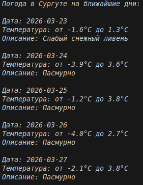

# Отчёт по лабораторной работе №5

## 1. Условия задач

### Задание
**Генератор, который обращается к внешнему API и возвращает результаты запросов.**

Необходимо создать генератор, который обращается к внешнему API и возвращает результаты запросов

## 2. Описание проделанной работы

### 2.1 Реализация генератора

Создана функция `weather_generator(city, days)`, которая:
- Использует координаты Сургута (широта: 61.25, долгота: 73.40)
- Делает GET-запрос к Open-Meteo API
- Получает прогноз погоды на указанное количество дней
- Использует `yield` для возврата данных по одному дню
- Возвращает словарь с датой, температурами и описанием погоды

### 2.2 Используемый API

**Open-Meteo API** — бесплатный сервис погоды:
- Не требует API ключа
- Предоставляет точные данные
- Поддерживает прогноз до 16 дней
- Возвращает коды погоды (weathercode)

### 2.3 Как работает генератор

1. Формируется URL с координатами Сургута
2. Выполняется запрос к API с помощью библиотеки `requests`
3. Данные парсятся из JSON-ответа
4. Оператор `yield` возвращает данные за один день и "замораживает" состояние функции
5. При следующей итерации цикла выполнение продолжается с места остановки
6. Возвращается следующий день из прогноза

### 2.4 Коды погоды

Для расшифровки кодов погоды создан словарь `weather_codes`:

| Код | Описание |
|-----|----------|
| 0 | Ясно |
| 1 | Преимущественно ясно |
| 2 | Переменная облачность |
| 3 | Пасмурно |
| 45 | Туман |
| 48 | Иней |
| 51-55 | Морось |
| 61-65 | Дождь |
| 71-75 | Снег |
| 80-82 | Ливень |
| 85-86 | Снежный ливень |
| 95-99 | Гроза |
```python
import requests

def weather_generator(city="Сургут", days=5):
    lat = 61.25
    lon = 73.40
    
    url = f"https://api.open-meteo.com/v1/forecast?latitude={lat}&longitude={lon}&daily=temperature_2m_max,temperature_2m_min,weathercode&timezone=auto&forecast_days={days}"
    
    response = requests.get(url)
    data = response.json()
    
    weather_codes = {
        0: "Ясно",
        1: "Преимущественно ясно",
        2: "Переменная облачность",
        3: "Пасмурно",
        45: "Туман",
        48: "Иней",
        51: "Слабая морось",
        53: "Умеренная морось",
        55: "Сильная морось",
        56: "Слабая ледяная морось",
        57: "Умеренная ледяная морось",
        61: "Слабый дождь",
        63: "Умеренный дождь",
        65: "Сильный дождь",
        66: "Слабый ледяной дождь",
        67: "Сильный ледяной дождь",
        71: "Слабый снег",
        73: "Умеренный снег",
        75: "Сильный снег",
        77: "Снежные зерна",
        80: "Слабый ливень",
        81: "Умеренный ливень",
        82: "Сильный ливень",
        85: "Слабый снежный ливень",
        86: "Сильный снежный ливень",
        95: "Слабая гроза",
        96: "Слабая гроза с градом",
        99: "Сильная гроза с градом"
    }
    
    for i in range(len(data["daily"]["time"])):
        code = data["daily"]["weathercode"][i]
        description = weather_codes.get(code, f"Неизвестно ({code})")
        
        yield {
            "date": data["daily"]["time"][i],
            "temp_max": data["daily"]["temperature_2m_max"][i],
            "temp_min": data["daily"]["temperature_2m_min"][i],
            "description": description
        }

print("Погода в Сургуте на ближайшие дни:\n")
for day in weather_generator("Сургут", 5):
    print(f"Дата: {day['date']}")
    print(f"Температура: от {day['temp_min']}°C до {day['temp_max']}°C")
    print(f"Описание: {day['description']}")
    print()
```
## 3. Скриншот


