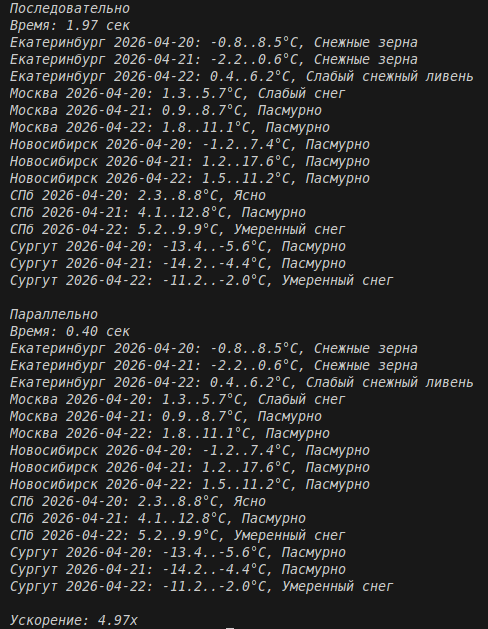

# Отчёт

## 1. Условия задач

### Задание
**Генератор, который обращается к внешнему API и возвращает результаты запросов.**

Необходимо создать генератор, который обращается к внешнему API и возвращает результаты запросов

## 2. Описание проделанной работы

### 2.1 Реализация генератора

Создана функция `weather_generator(city, days)`, которая:
- Использует координаты Сургута (широта: 61.25, долгота: 73.40)
- Делает GET-запрос к Open-Meteo API
- Получает прогноз погоды на указанное количество дней
- Использует `yield` для возврата данных по одному дню
- Возвращает словарь с датой, температурами и описанием погоды

### 2.2 Используемый API

**Open-Meteo API** — бесплатный сервис погоды:
- Не требует API ключа
- Предоставляет точные данные
- Поддерживает прогноз до 16 дней
- Возвращает коды погоды (weathercode)

### 2.3 Как работает генератор

1. Формируется URL с координатами Сургута
2. Выполняется запрос к API с помощью библиотеки `requests`
3. Данные парсятся из JSON-ответа
4. Оператор `yield` возвращает данные за один день и "замораживает" состояние функции
5. При следующей итерации цикла выполнение продолжается с места остановки
6. Возвращается следующий день из прогноза

### 2.4 Коды погоды

Для расшифровки кодов погоды создан словарь `weather_codes`:

| Код | Описание |
|-----|----------|
| 0 | Ясно |
| 1 | Преимущественно ясно |
| 2 | Переменная облачность |
| 3 | Пасмурно |
| 45 | Туман |
| 48 | Иней |
| 51-55 | Морось |
| 61-65 | Дождь |
| 71-75 | Снег |
| 80-82 | Ливень |
| 85-86 | Снежный ливень |
| 95-99 | Гроза |

### 2.5 Последовательная версия
Функция sequential(cities, days):
- Перебирает города в цикле for
- Для каждого города вызывает get_weather()
- Собирает все результаты в один список
- Запросы выполняются строго по очереди

### 2.6 Параллельная версия
Функция parallel(cities, days) с использованием ThreadPoolExecutor:
- Создаёт пул потоков с max_workers=5
- Использует executor.map() для параллельного запуска запросов
- Каждый город обрабатывается в отдельном потоке
- Результаты собираются после завершения всех потоков

### 2.7 Замер производительности
Для сравнения версий использован модуль time

### 2.8 Код

```python
import requests
from concurrent.futures import ThreadPoolExecutor
import time

WEATHER_CODES = {
        0: "Ясно",
        1: "Преимущественно ясно",
        2: "Переменная облачность",
        3: "Пасмурно",
        45: "Туман",
        48: "Иней",
        51: "Слабая морось",
        53: "Умеренная морось",
        55: "Сильная морось",
        56: "Слабая ледяная морось",
        57: "Умеренная ледяная морось",
        61: "Слабый дождь",
        63: "Умеренный дождь",
        65: "Сильный дождь",
        66: "Слабый ледяной дождь",
        67: "Сильный ледяной дождь",
        71: "Слабый снег",
        73: "Умеренный снег",
        75: "Сильный снег",
        77: "Снежные зерна",
        80: "Слабый ливень",
        81: "Умеренный ливень",
        82: "Сильный ливень",
        85: "Слабый снежный ливень",
        86: "Сильный снежный ливень",
        95: "Слабая гроза",
        96: "Слабая гроза с градом",
        99: "Сильная гроза с градом"
}

CITIES = {
    "Сургут": (61.25, 73.40),
    "Москва": (55.75, 37.62),
    "СПб": (59.93, 30.33),
    "Новосибирск": (55.00, 82.93),
    "Екатеринбург": (56.83, 60.60)
}

def get_weather(city, days=5):
    lat, lon = CITIES[city]
    url = f"https://api.open-meteo.com/v1/forecast?latitude={lat}&longitude={lon}&daily=temperature_2m_max,temperature_2m_min,weathercode&timezone=auto&forecast_days={days}"
    r = requests.get(url).json()
    result = []
    for i in range(len(r["daily"]["time"])):
        result.append({
            "city": city,
            "date": r["daily"]["time"][i],
            "temp_min": r["daily"]["temperature_2m_min"][i],
            "temp_max": r["daily"]["temperature_2m_max"][i],
            "desc": WEATHER_CODES.get(r["daily"]["weathercode"][i], "???")
        })
    return result

def sequential(cities, days):
    all_data = []
    for city in cities:
        all_data += get_weather(city, days)
    return all_data

def parallel(cities, days):
    with ThreadPoolExecutor(max_workers=5) as executor:
        results = executor.map(lambda c: get_weather(c, days), cities)
    all_data = []
    for r in results:
        all_data += r
    return all_data

def show(data):
    for d in sorted(data, key=lambda x: (x["city"], x["date"])):
        print(f"{d['city']} {d['date']}: {d['temp_min']}..{d['temp_max']}°C, {d['desc']}")

cities = list(CITIES.keys())
days = 3

print("Последовательно")
start = time.time()
data1 = sequential(cities, days)
t1 = time.time() - start
print(f"Время: {t1:.2f} сек")
show(data1)

print("\nПараллельно")
start = time.time()
data2 = parallel(cities, days)
t2 = time.time() - start
print(f"Время: {t2:.2f} сек")
show(data2)


print(f"\nУскорение: {t1 / t2:.2f}x")
```
## 3. Скриншот


