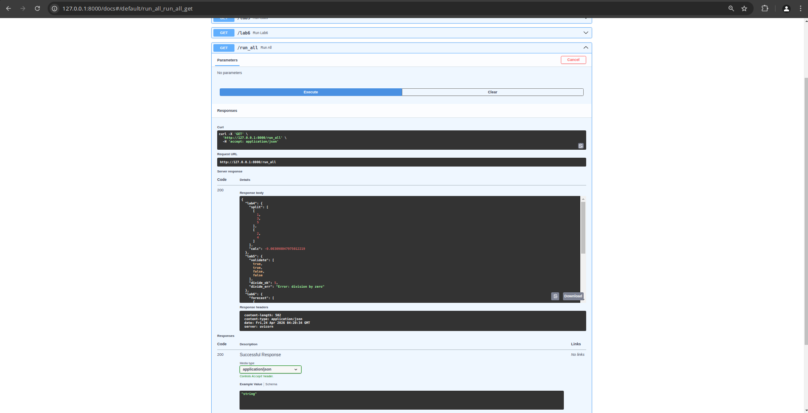

# Отчёт

## 1. Условия задач

### Лабораторная 4
#### Задание 1
Написать функцию, которая разделяет список на n частей. Элементы распределяются по подспискам циклически по индексу.
Примеры:
- split([1,2,3,4,5], 2) → [[1, 3, 5], [2, 4]]
- split([1,2,3,4,5], 3) → [[1, 4], [2, 5], [3]]

Сколько существует таких слов, которые может написать Вася?
#### Задание 2
Написать функцию для вычисления члена рекуррентной последовательности:

`v_i=(i+1)/(i^2+1)*v_{i-1}-v_{i-2}*v_{i-3}`

Начальные условия: v₁ = 0, v₂ = 0, v₃ = 1.5
Для каждой задачи реализовать два варианта решения: с использованием рекурсии и без рекурсии (итеративный).

### Лабораторная 5
#### Задание 1
Необходимо реализовать замыкание, которое создаёт функцию для проверки принадлежности значений заданному числовому диапазону.
#### Задание 2
Необходимо реализовать декоратор, перехватывающий исключения в функциях и возвращающий информативные сообщения об ошибках.
### Лабораторная 6
#### Задание
Необходимо создать генератор, который обращается к внешнему API и возвращает результаты запросов

## 2. Описание проделанной работы

Создал пакет modules с тремя модулями и веб-приложение на FastAPI в main.py.

Что внутри:
- lab4.py: Функции split_iter_opt/split_rec_opt для разбиения списка и calc_v_iter_opt/calc_v_rec_opt для вычисления рекуррентной последовательности (с @lru_cache для оптимизации рекурсии).
- lab5.py: Класс-декоратор @safe_execute для обработки исключений и класс-валидатор range_validator для проверки диапазона значений.
- lab6.py: Функции get_weather, sequential, parallel для получения прогноза погоды через Open-Meteo API с поддержкой многопоточности через ThreadPoolExecutor.
## 3. Как запустить
### Установка зависимостей
```bash
# Установить пакеты
pip install -r requirements.txt
```
### Запуск веб-приложеня
```bash
uvicorn main:app --reload
```
### Веб-приложение
Веб приложение доступно по ссылке `http://127.0.0.1:8000/docs`
## 4. Скриншот



## 5. Ссылки на используемые материалы
1. [FastAPI](https://fastapi.tiangolo.com/)