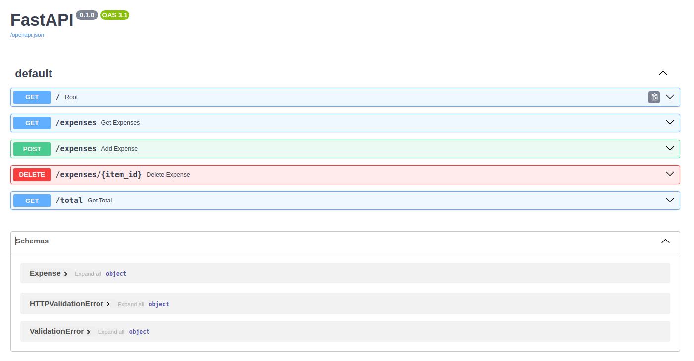

# Отчёт

## Финансовый трекер расходов

### 1. Описание

Приложение предназначено для учета личных финансов в формате веб-приложения на базе FastAPI. Позволяет добавлять расходы по категориям, удалять записи, просматривать историю операций и общую сумму трат.

### 2. Инструкции по запуску
#### Требования
- Установленный Python 3.8 или выше.
- Установленные библиотеки: fastapi, uvicorn, pydantic.
- Права на запись в папку с программой (для сохранения файла данных).
#### Запуск
Запустите веб-приложение командой:
``` bash
uvicorn main:app --reload
```
#### Веб-приложение
Веб приложение доступно по ссылке <http://127.0.0.1:8000/docs>
### 3. Краткая справка

После запуска откройте в браузере автоматическую документацию по адресу <http://127.0.0.1:8000/docs>. Управление приложением осуществляется через HTTP-запросы:

| Метод    | Эндпоинт         | Действие |
|----------|------------------|----------|
| `GET`    | `/`              | Информация о работе API и ссылка на документацию |
| `POST`   | `/expenses`      | Добавить расход (в теле запроса передаются: сумма, категория, описание) |
| `GET`    | `/expenses`      | Показать все записанные расходы |
| `DELETE` | `/expenses/{id}` | Удалить запись по указанному идентификатору |
| `GET`    | `/total`         | Получить общую сумму всех трат |

### 4. Хранение данных
Все записи сохраняются в файл `expenses.json` в формате JSON. Вы можете открыть его любым текстовым редактором, но рекомендуется редактировать данные только через меню веб-программы.

### 5. Скриншот:

